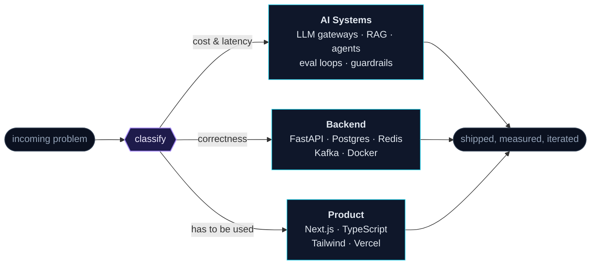

<div align="center">
  
</div>

<p align="center">
  <a href="https://kolanikhiljai.vercel.app/"></a>
  <a href="https://linkedin.com/in/nikhil-jai"></a>
  <a href="mailto:nikhilraina95@gmail.com"></a>
  
</p>

---

### `~/ whoami`

```txt
Kola Nikhil Jai
B.Tech Information Technology — Vignan Institute of Technology & Science, Hyderabad
SWE Intern @ CDPL · Feb 2026 → present

I build the unglamorous middle of AI products: the gateway that picks the
right model, the worker that reproduces a bug inside a sandbox before it
touches a PR, and the cache that makes the second call cost nothing.
```

---

### `~/ how I route a problem`

<div align="center">



</div>

---

### `~/ featured builds`

| Project | What it actually does | Stack |
|:--|:--|:--|
| **[Triage Agent](https://github.com/Nikhiljai03/Triage-Agent)** | Autonomous GitHub issue triage — RAG-based duplicate detection, reproduces bugs in a sandboxed Docker container, classifies severity, drafts fix PRs. Dry-run by default, behind guardrails. | `FastAPI` `Qdrant` `Redis` `Docker` |
| **[Multi-LLM Query Router](https://github.com/Nikhiljai03/Multi-LLM-Query-Router)** | Production LLM gateway that routes queries across a 3-tier model ladder by complexity. Provider fallback, 40–60% cache hit rate, sub-20ms on cached repeats, Kafka analytics. | `FastAPI` `Groq` `Kafka` `Redis` |
| **[Respiratory Sound Diagnostic Engine](https://github.com/Nikhiljai03/Respiratory-Sound-Diagnostic-Engine)** | Classifies 8 lung conditions from cough audio. MFCC feature pipeline turning 1D signals into spectral tensors, fed to a CNN classifier. | `TensorFlow` `Librosa` `NumPy` |
| **[ShareSpace](https://github.com/Nikhiljai03/ShareSpcae)** | Full-stack social platform — auth, posts, media uploads, threaded discussion. [Live →](https://share-spcae.vercel.app/) | `Next.js` `Prisma` `Neon` `Clerk` |

---

### `~/ stack`

| | |
|:--|:--|
| **Languages** | Python · TypeScript · JavaScript · Java · SQL |
| **AI / ML** | TensorFlow · Keras · Librosa · RAG + vector search (Qdrant) · Groq · Together AI |
| **Backend** | FastAPI · Node.js · Prisma · PostgreSQL · MongoDB · Redis · Kafka |
| **Frontend** | Next.js · React · Tailwind · shadcn/ui |
| **Infra** | Docker · AWS · Vercel · GitHub Actions |

---

### `~/ signals`

<div align="center">
  <picture>
    <source media="(prefers-color-scheme: dark)" srcset="https://github-readme-stats.vercel.app/api?username=Nikhiljai03&show_icons=true&hide_border=true&hide_title=true&bg_color=00000000&text_color=94A3B8&icon_color=22D3EE&ring_color=A78BFA">
    
  </picture>
  <picture>
    <source media="(prefers-color-scheme: dark)" srcset="https://github-readme-stats.vercel.app/api/top-langs/?username=Nikhiljai03&layout=compact&hide_border=true&hide_title=true&bg_color=00000000&text_color=94A3B8&langs_count=6">
    
  </picture>
</div>

---

### `~/ currently`

```console
$ nikhil --status
▸ shipping   agentic dev-tooling — issue triage, sandboxed repro, auto-PR
▸ learning   distributed systems, eval harnesses for LLM pipelines
▸ open to    backend / AI-infra internships and open-source collaboration
```

<div align="center">
  <br>
  <sub><i>"In the game of algorithms, I compete to dominate and conquer to win."</i></sub>
  <br><br>
  <a href="https://kolanikhiljai.vercel.app/"><b>Portfolio</b></a> ·
  <a href="https://linkedin.com/in/nikhil-jai"><b>LinkedIn</b></a> ·
  <a href="mailto:nikhilraina95@gmail.com"><b>Email</b></a> ·
  <a href="https://github.com/Nikhiljai03?tab=repositories"><b>All repos</b></a>
</div>
