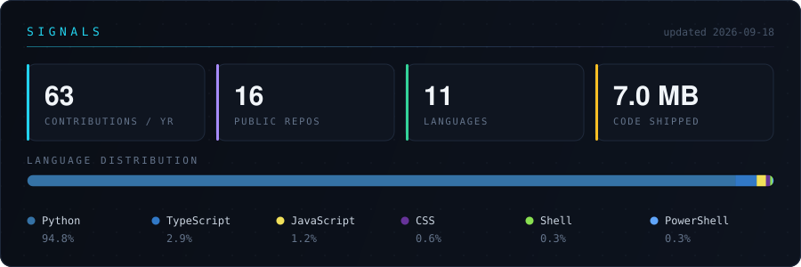

  

  
  
  
  

  

---

### `~/ how I route a problem`

---

### `~/ featured builds`

| Project | What it actually does | Stack |
|:--|:--|:--|
| **[Triage Agent](https://github.com/Nikhiljai03/Triage-Agent)** | Autonomous GitHub issue triage — RAG-based duplicate detection, reproduces bugs in a sandboxed Docker container, classifies severity, drafts fix PRs. Dry-run by default, behind guardrails. | `FastAPI` `Qdrant` `Redis` `Docker` |
| **[Multi-LLM Query Router](https://github.com/Nikhiljai03/Multi-LLM-Query-Router)** | Production LLM gateway that routes queries across a 3-tier model ladder by complexity. Provider fallback, 40–60% cache hit rate, sub-20ms on cached repeats, Kafka analytics. | `FastAPI` `Groq` `Kafka` `Redis` |
| **[Respiratory Sound Diagnostic Engine](https://github.com/Nikhiljai03/Respiratory-Sound-Diagnostic-Engine)** | Classifies 8 lung conditions from cough audio. MFCC feature pipeline turning 1D signals into spectral tensors, fed to a CNN classifier. | `TensorFlow` `Librosa` `NumPy` |
| **[ShareSpace](https://github.com/Nikhiljai03/ShareSpcae)** | Full-stack social platform — auth, posts, media uploads, threaded discussion. [Live →](https://share-spcae.vercel.app/) | `Next.js` `Prisma` `Neon` `Clerk` |

---

### `~/ stack`

| | |
|:--|:--|
| **Languages** | Python · TypeScript · JavaScript · Java · SQL |
| **AI / ML** | TensorFlow · Keras · Librosa · RAG + vector search (Qdrant) · Groq · Together AI |
| **Backend** | FastAPI · Node.js · Prisma · PostgreSQL · MongoDB · Redis · Kafka |
| **Frontend** | Next.js · React · Tailwind · shadcn/ui |
| **Infra** | Docker · AWS · Vercel · GitHub Actions |

---

### `~/ signals`

  
    
  Rendered straight from the GitHub API by a <a href="https://github.com/Nikhiljai03/Nikhiljai03/actions/workflows/stats.yml">scheduled Action</a> — self-hosted, no third-party widgets.

   
  <i>"In the game of algorithms, I compete to dominate and conquer to win."</i>
    
  <a href="https://kolanikhiljai.vercel.app/"><b>Portfolio</b></a> ·
  <a href="https://linkedin.com/in/nikhil-jai"><b>LinkedIn</b></a> ·
  <a href="mailto:nikhilraina95@gmail.com"><b>Email</b></a> ·
  <a href="https://github.com/Nikhiljai03?tab=repositories"><b>All repos</b></a>

